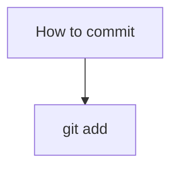

# Шпаргалка по GIT  и GITHUB
---

## GIT 

GIT - система контроля версий

## Командная строка

Большинство пользователей Git используют консоли с наборами команд, похожие на те, что применяют в macOS и Linux. 

Для этого нужно установить специальный консольный инструмент для Windows, который называется Git Bash.

Он установит не только Bash, но и сам Git

## Создаем локальный репозиторий

### Инициализируем репозиторий — **git init**

Чтобы Git начал отслеживать изменения в проекте, папку с файлами этого проекта нужно сделать Git-репозиторием. Для этого следует переместиться в неё и ввести команду git init
```
$ cd ~/dev/first-project # перешли в нужную папку
$ git init # создали репозиторий
```
В подпапке .git Git будет хранить всю служебную информацию.

**«Разгитить» папку, если что-то пошло не так, — rm -rf .git**
```
$ cd <папка с репозиторием> # перешли в папку

$ rm -rf .git # удалили подпапку .git
```
-rf:
* ключ -r (от англ. recursive — «рекурсивно») позволяет удалять папки вместе с их содержимым;
* ключ -f (от англ. force — «заставить») избавит вас от вопросов вроде «Вы точно хотите удалить этот файл? А этот? И этот тоже?».

###Проверить состояние репозитория — **git status**

После инициализации репозитория first-project запустите команду git status — она показывает текущее состояние репозитория.

### Подготовить файлы к сохранению — **git add**

Создайте файлы todo.txt и readme.txt в папке first-project 

Мы хотим отслеживать состояние обоих, поэтому можем использовать команду git add --all. 
```
$ touch todo.txt
$ touch readme.txt
# создали файлы todo.txt и readme.txt

$ git add --all # подготовили к сохранению все файлы в репозитории
$ git status # проверили статус  
```

Добавлять файлы можно и по одному.
```
$ git add todo.txt
$ git add readme.txt
$ git status 
```

Также можно добавить текущую папку целиком. Обратиться к текущей папке в Bash позволяет точка (.).

```
$ git add . # добавить всю текущую папку
$ git status 
```

### Делаем коммит — **git commit**

Коммит гарантирует, что изменения будут сохранены в истории и при необходимости к ним можно будет «откатиться». 

gерейдите в папку first-project и выполните коммит со следующим комментарием.

```
$ git commit -m 'Мой первый коммит!' 
```

Ключ -m присваивает коммиту сообщение.
Обычно в таком сообщении поясняется, в чём именно состояли изменения. Оно пишется после ключа -m в кавычках.

How to commit



### Просматриваем историю коммитов
## Создаем удаленный репозиторий
## Синхронизация репозиториев
### Генерация SSH ключей
### Привязка SSH ключа к GitHub
### Связывание локального и удаленного репозиториев
### Синхронизация локального и удаленного репозиториев

