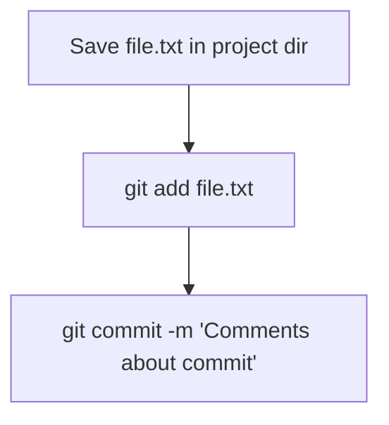

# Шпаргалка по GIT  и GITHUB
---

## GIT 

GIT - система контроля версий

## Командная строка

Большинство пользователей Git используют консоли с наборами команд, похожие на те, что применяют в macOS и Linux. 

Для этого нужно установить специальный консольный инструмент для Windows, который называется Git Bash.

Он установит не только Bash, но и сам Git


## Настройка GIT

### Работа с файлом настройки **.gitconfig**
Чтобы использовать Git в команде и участникам проекта было понятно, кто и какие изменения вносил, нужно представиться и указать имя пользователя и адрес электронной почты.

Не имеет значения, в какой директории вы находитесь прямо сейчас: вызов git config --global сработает везде.


```BASH
$ git config --global user.name "User Namovich" 
# имя или ник нужно написать латиницей и в кавычках

$ git config --global user.email username@yandex.ru
# здесь нужно указать свой настоящий email 
```

Все глобальные настройки Git хранит в файле .gitconfig в домашней директории. Команда запишет в этот файл указанные имя и почту. Чтобы убедиться в этом, можно вызвать команду для чтения файлов.

```
$ cat ~/.gitconfig 
```

Другой способ проверки — вывести содержимое файла конфигурации Git той же командой git config с флагом --list (англ. «список»).
```
$ git config --list 
```

## Создаем локальный репозиторий

### Инициализируем репозиторий — **git init**

Чтобы Git начал отслеживать изменения в проекте, папку с файлами этого проекта нужно сделать Git-репозиторием. Для этого следует переместиться в неё и ввести команду git init
```
$ cd ~/dev/first-project # перешли в нужную папку
$ git init # создали репозиторий
```
В подпапке .git Git будет хранить всю служебную информацию.

**«Разгитить» папку, если что-то пошло не так, — rm -rf .git**
```
$ cd <папка с репозиторием> # перешли в папку

$ rm -rf .git # удалили подпапку .git
```
-rf:
* ключ -r (от англ. recursive — «рекурсивно») позволяет удалять папки вместе с их содержимым;
* ключ -f (от англ. force — «заставить») избавит вас от вопросов вроде «Вы точно хотите удалить этот файл? А этот? И этот тоже?».

###Проверить состояние репозитория — **git status**

После инициализации репозитория first-project запустите команду git status — она показывает текущее состояние репозитория.

### Подготовить файлы к сохранению — **git add**

Создайте файлы todo.txt и readme.txt в папке first-project 

Мы хотим отслеживать состояние обоих, поэтому можем использовать команду git add --all. 
```
$ touch todo.txt
$ touch readme.txt
# создали файлы todo.txt и readme.txt

$ git add --all # подготовили к сохранению все файлы в репозитории
$ git status # проверили статус  
```

Добавлять файлы можно и по одному.
```
$ git add todo.txt
$ git add readme.txt
$ git status 
```

Также можно добавить текущую папку целиком. Обратиться к текущей папке в Bash позволяет точка (.).

```
$ git add . # добавить всю текущую папку
$ git status 
```

### Делаем коммит — **git commit**

Коммит гарантирует, что изменения будут сохранены в истории и при необходимости к ним можно будет «откатиться». 

gерейдите в папку first-project и выполните коммит со следующим комментарием.

```
$ git commit -m 'Мой первый коммит!' 
```

Ключ -m присваивает коммиту сообщение.
Обычно в таком сообщении поясняется, в чём именно состояли изменения. Оно пишется после ключа -m в кавычках.


Отобразим процесс коммита сехмой mermaid:
* flowchart TD блок-схема программы
* graph LR - обычная графичесская схема

Вертикальная блок схема:



Горизонтальная блок схема:


### Просматриваем историю коммитов — **git log**

Чтобы увидеть все коммиты, введите команду git log.

Обратите внимание, что по умолчанию git log выводит коммиты в обратном хронологическом порядке — последние коммиты оказываются первыми сверху. В этом можно убедиться, если посмотреть на дату и время их создания.

## Создаем удаленный репозиторий на **GitHub**

GitHub — платформа для хранения IT-проектов и совместной работы над ними с использованием Git. По сути, это сайт, куда можно загрузить файлы своего проекта для обмена с другими людьми.

Git и GitHub — это два разных проекта, которые развиваются независимо друг от друга. 

Git:
- консольный инструмент для работы с локальными и удалёнными репозиториями;
- проект с открытым исходным кодом.

GitHub:
- платформа для размещения удалённых репозиториев;
- принадлежит компании Microsoft.

**Инструкция**

1. Зайдите в свой профиль по ссылке https://github.com/username, где username — имя, которое вы указали при регистрации.
1. Создайте репозиторий. Для этого перейдите на вкладку Repositories (англ. «репозитории»), а затем нажмите на зелёную кнопку New (англ. «новый») справа.
1. Открылось окно создания нового репозитория. Назовите его first-project. Название удалённого репозитория необязательно должно совпадать с именем папки проекта у вас на компьютере. Но чтобы не путаться, будем называть их одинаково.

Другие поля вам пока не понадобятся. Смело нажимайте на зелёную кнопку Create repository (англ. «создать репозиторий») внизу.

Осталось связать удалённый репозиторий с локальным, который уже есть на вашем компьютере.

Но прежде, чтобы упростить работу с GitHub и сделать её более безопасной, вы научитесь генерировать SSH-ключи (от англ. Secure Shell — «безопасная оболочка»).


## Синхронизация репозиториев

### Генерация SSH ключей

**Что такое SSH**

Когда компьютеры обмениваются данными в сети, они следуют сетевым протоколам — правилам обмена данными между компьютерами.

Один из наиболее распространённых сетевых протоколов — SSH (от англ. Secure Shell Protocol).

Он обеспечивает безопасный обмен данными в сети. С помощью этого протокола можно получать данные с удалённого компьютера или отправлять их на него. Трафик шифруется, поэтому протокол безопасен.

SSH использует пару ключей для обеспечения безопасности — публичный и приватный: 
* Приватный ключ (англ. private key) хранится только на вашем компьютере и не должен передаваться кому-либо ещё. Он используется для расшифровки данных.
* Публичный ключ (англ. public key) доступен всем и используется для шифрования данных. Они могут быть расшифрованы парным приватным ключом.

Только вы можете расшифровать данные с помощью приватного ключа, но любой владелец публичного ключа может их для вас зашифровать. Эти два ключа связаны и образуют SSH-пару.

В будущем вы наверняка будете использовать их для взаимодействия с GitHub и другими удалёнными серверами.

**Проверка наличия SSH-ключа**

Прежде чем генерировать SSH-ключи, убедитесь, что у вас их ещё нет. По умолчанию директория с SSH-ключами находится в домашней директории пользователя. Перейдите в неё.

Обычно SSH-ключи находятся в директории .ssh/. Проверить наличие этой директории и файлов в ней можно с помощью следующей команды.

```
$ cd ~ # перешли в домашнюю директорию 
$ ls -la .ssh/ # вывели список созданных ключей 
```

Если папка пустая или её нет, всё в порядке. 
Если есть файлы с похожими названиями, SSH-ключи уже создавались:

* id_dsa.pub;
id_ecdsa.pub;
id_ed25519.pub;
id_rsa.pub.

Если вы не создавали эти файлы, удалите их все.

**Инструкция генерации SSH ключей**

1. Для генерации SSH-пары можно использовать программу ssh-keygen. Откройте терминал и введите следующую команду.
```
$ ssh-keygen -t ed25519 -C "электронная почта, к которой привязан ваш аккаунт на GitHub" 
```

Используйте электронную почту, к которой привязан ваш GitHub-аккаунт.
    
Если вы видите сообщение об ошибке, то, скорее всего, ваша система не поддерживает алгоритм шифрования ed25519. Ничего страшного: используйте другой алгоритм.

```
$ ssh-keygen -t rsa -b 4096 -C "электронная почта, к которой привязан ваш аккаунт на GitHub" 
```

2. Укажите место хранения ключей. Простой вариант — сделать домашний каталог пользователя путём по умолчанию. Для этого нажмите Enter.

3. Программа запросит кодовую фразу (англ. passphrase) для доступа к SSH-ключу. Вы можете оставить поле пустым. Для этого нажмите Enter, а затем ещё раз Enter для подтверждения.

> Enter passphrase (empty for no passphrase): [Type a passphrase]
> Enter same passphrase again: [Type passphrase again] 

4. Готово! Теперь осталось проверить, что ключи действительно сгенерировались. Для этого вызовите эту команду.

```BACH
ls -a ~/.ssh 
```

 На экране должны появиться два файла — один с расширением .pub, другой — без. Файл в .pub — публичный, им можно делиться с веб-сайтами или коллегами. Файл без расширения .pub — приватный. Ни в коем случае не передавайте его никому! 


### Привязка SSH ключа к GitHub

1. После выполнения команды `ssh-keygen` из предыдущего урока в директории `~/.ssh` будет создано два файла — `id_ed25519` и `id_ed25519.pub` (или `id_rsa` и `id_rsa.pub` — в зависимости от того, какой алгоритм вы использовали):
* `id_ed25519/id_rsa` — приватный ключ (файл без .pub в конце). Ни в коем случае не копируйте его и не делитесь им.
* `id_ed25519.pub/id_rsa.pub` — публичный ключ (на это указывает расширение .pub).
Скопируйте содержимое файла с публичным ключом в буфер обмена.

```
# скопировать содержимое ключа в буфер обмена:
$ clip < ~/.ssh/id_rsa.pub
# для ed25519:
$ clip < ~/.ssh/id_ed25519.pub 
```

Если clip не сработает, выведите содержимое файла с помощью 

```
cat ~/.ssh/id_rsa.pub
# или 
cat ~/.ssh/id_ed25519.pub 

```
 и скопируйте вывод в буфер обмена из консоли.

2. Перейдите на GitHub и выберите пункт Settings (англ. «настройки») в меню аккаунта. 
3. В меню слева нажмите на пункт SSH and GPG keys.
4. В открывшейся вкладке выберите New SSH key (англ. «новый SSH-ключ»).
5. В поле Title (англ. «заголовок») напишите название ключа. Например, Personal key (англ. «личный ключ»).
6. В поле Key type (англ. «тип ключа») должно быть Authentication Key (англ. «ключ аутентификации»).
7. В поле Key скопируйте ваш ключ из буфера обмена.
8. Нажмите на кнопку Add SSH key (англ. «добавить SSH-ключ»).
9. Проверьте правильность ключа с помощью следующей команды.

```BASH
$ ssh -T git@github.com 
```

10. Введите `yes`, чтобы продолжить. Вы увидите приветствие на экране.

### Связывание локального и удаленного репозиториев — **git remote add**

Перейдите на страницу удалённого репозитория, выберите тип SSH и скопируйте URL. Кнопка справа позволит сделать это мгновенно.

Откройте консоль, перейдите в каталог локального репозитория и введите команду `git remote add`

```BASH
$ cd ~/dev/first-project
$ git remote add origin git@github.com:%ИМЯ_АККАУНТА%/first-project.git 
```

Команде необходимо передать два параметра: имя удалённого репозитория и его URL. В качестве имени используйте слово origin. А URL вы скопировали со страницы удалённого репозитория.

`origin` (англ. «источник») — стандартный псевдоним, с помощью которого можно обращаться к главному удалённому репозиторию (обычно такой репозиторий один). Это значительно упрощает работу.

### Убедиться, что репозитории связаны, **— git remote -v**

Чтобы убедиться, что репозитории связаны, выполнить:

```
$ git remote -v

origin    git@github.com:%ИМЯ_АККАУНТА%/%ИМЯ-ПРОЕКТА%.git (fetch)
origin    git@github.com:%ИМЯ_АККАУНТА%/%ИМЯ-ПРОЕКТА%.git (push) 
```

В выводе вы должны увидеть две строчки, аналогичные тем, что показаны выше.
Флаг -v — короткая форма флага --verbose (англ. «подробный»). Он позволяет показать больше информации в выводе.

### Отправить изменения на удалённый репозиторий — **git push**

В первый раз эту команду нужно вызвать с флагом -u и параметрами origin (имя удалённого репозитория) и main или master (название текущей ветки). 

Флаг -u свяжет локальную ветку с одноимённой удалённой. Как вы связывали локальный и удалённый репозитории в предыдущем уроке, так же и здесь нужно дополнительно связать ветки.
$ git push -u origin main # Если команда приведёт к ошибке, попробуйте 
                          # заменить main на master. 

В дальнейшем при работе с удалённым репозиторием флаг -u можно опустить и писать просто `git push`.

