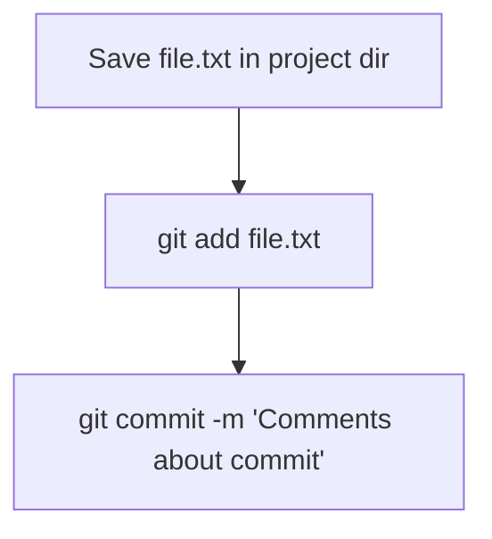
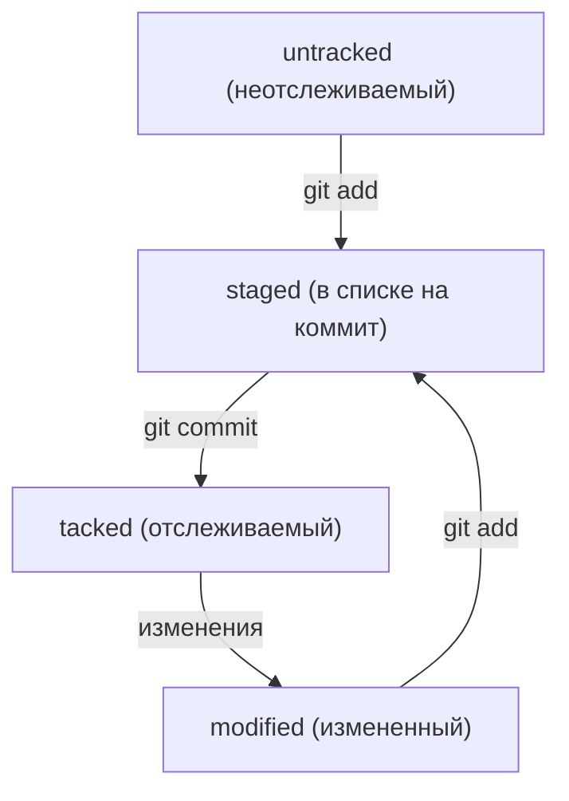
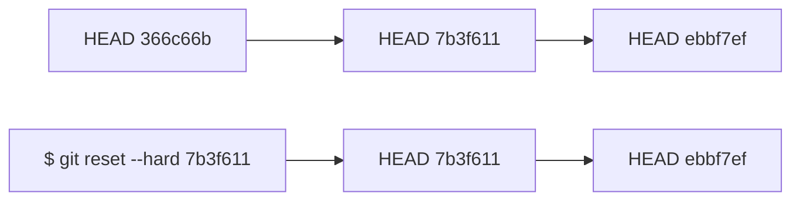
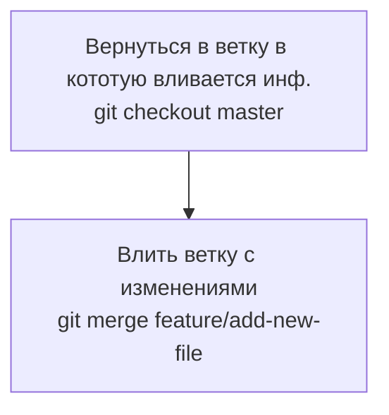
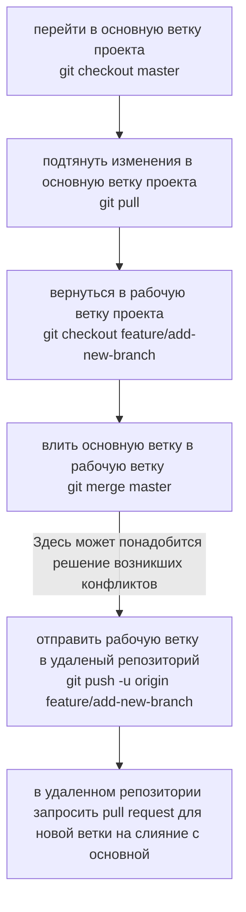

# Шпаргалка по GIT  и GITHUB
---

## GIT 

GIT - система контроля версий

## Командная строка

Большинство пользователей Git используют консоли с наборами команд, похожие на те, что применяют в macOS и Linux. 

Для этого нужно установить специальный консольный инструмент для Windows, который называется Git Bash.

Он установит не только Bash, но и сам Git


## Настройка GIT

### Работа с файлом настройки **.gitconfig**
Чтобы использовать Git в команде и участникам проекта было понятно, кто и какие изменения вносил, нужно представиться и указать имя пользователя и адрес электронной почты.

Не имеет значения, в какой директории вы находитесь прямо сейчас: вызов git config --global сработает везде.


```BASH
$ git config --global user.name "User Namovich" 
# имя или ник нужно написать латиницей и в кавычках

$ git config --global user.email username@yandex.ru
# здесь нужно указать свой настоящий email 
```

Все глобальные настройки Git хранит в файле .gitconfig в домашней директории. Команда запишет в этот файл указанные имя и почту. Чтобы убедиться в этом, можно вызвать команду для чтения файлов.

```
$ cat ~/.gitconfig 
```

Другой способ проверки — вывести содержимое файла конфигурации Git той же командой git config с флагом --list (англ. «список»).
```
$ git config --list 
```

## Создаем локальный репозиторий

### Инициализируем репозиторий — **git init**

Чтобы Git начал отслеживать изменения в проекте, папку с файлами этого проекта нужно сделать Git-репозиторием. Для этого следует переместиться в неё и ввести команду git init
```
$ cd ~/dev/first-project # перешли в нужную папку
$ git init # создали репозиторий
```
В подпапке .git Git будет хранить всю служебную информацию.

**«Разгитить» папку, если что-то пошло не так, — rm -rf .git**
```
$ cd <папка с репозиторием> # перешли в папку

$ rm -rf .git # удалили подпапку .git
```
-rf:
* ключ -r (от англ. recursive — «рекурсивно») позволяет удалять папки вместе с их содержимым;
* ключ -f (от англ. force — «заставить») избавит вас от вопросов вроде «Вы точно хотите удалить этот файл? А этот? И этот тоже?».

###Проверить состояние репозитория — **git status**

После инициализации репозитория first-project запустите команду git status — она показывает текущее состояние репозитория.

### Подготовить файлы к сохранению — **git add**

Создайте файлы todo.txt и readme.txt в папке first-project 

Мы хотим отслеживать состояние обоих, поэтому можем использовать команду git add --all. 
```
$ touch todo.txt
$ touch readme.txt
# создали файлы todo.txt и readme.txt

$ git add --all # подготовили к сохранению все файлы в репозитории
$ git status # проверили статус  
```

Добавлять файлы можно и по одному.
```
$ git add todo.txt
$ git add readme.txt
$ git status 
```

Также можно добавить текущую папку целиком. Обратиться к текущей папке в Bash позволяет точка (.).

```
$ git add . # добавить всю текущую папку
$ git status 
```

### Делаем коммит — **git commit**

Коммит гарантирует, что изменения будут сохранены в истории и при необходимости к ним можно будет «откатиться». 

gерейдите в папку first-project и выполните коммит со следующим комментарием.

```
$ git commit -m 'Мой первый коммит!' 
```

Ключ -m присваивает коммиту сообщение.
Обычно в таком сообщении поясняется, в чём именно состояли изменения. Оно пишется после ключа -m в кавычках.


Отобразим процесс коммита сехмой mermaid:
* flowchart TD блок-схема программы
* graph LR - обычная графичесская схема

Вертикальная блок схема:



Горизонтальная блок схема:


### Просматриваем историю коммитов — **git log**

Чтобы увидеть все коммиты, введите команду git log.

Обратите внимание, что по умолчанию git log выводит коммиты в обратном хронологическом порядке — последние коммиты оказываются первыми сверху. В этом можно убедиться, если посмотреть на дату и время их создания.

## Создаем удаленный репозиторий на **GitHub**

GitHub — платформа для хранения IT-проектов и совместной работы над ними с использованием Git. По сути, это сайт, куда можно загрузить файлы своего проекта для обмена с другими людьми.

Git и GitHub — это два разных проекта, которые развиваются независимо друг от друга. 

Git:
- консольный инструмент для работы с локальными и удалёнными репозиториями;
- проект с открытым исходным кодом.

GitHub:
- платформа для размещения удалённых репозиториев;
- принадлежит компании Microsoft.

**Инструкция**

1. Зайдите в свой профиль по ссылке https://github.com/username, где username — имя, которое вы указали при регистрации.
1. Создайте репозиторий. Для этого перейдите на вкладку Repositories (англ. «репозитории»), а затем нажмите на зелёную кнопку New (англ. «новый») справа.
1. Открылось окно создания нового репозитория. Назовите его first-project. Название удалённого репозитория необязательно должно совпадать с именем папки проекта у вас на компьютере. Но чтобы не путаться, будем называть их одинаково.

Другие поля вам пока не понадобятся. Смело нажимайте на зелёную кнопку Create repository (англ. «создать репозиторий») внизу.

Осталось связать удалённый репозиторий с локальным, который уже есть на вашем компьютере.

Но прежде, чтобы упростить работу с GitHub и сделать её более безопасной, вы научитесь генерировать SSH-ключи (от англ. Secure Shell — «безопасная оболочка»).


## Синхронизация репозиториев

### Генерация SSH ключей

**Что такое SSH**

Когда компьютеры обмениваются данными в сети, они следуют сетевым протоколам — правилам обмена данными между компьютерами.

Один из наиболее распространённых сетевых протоколов — SSH (от англ. Secure Shell Protocol).

Он обеспечивает безопасный обмен данными в сети. С помощью этого протокола можно получать данные с удалённого компьютера или отправлять их на него. Трафик шифруется, поэтому протокол безопасен.

SSH использует пару ключей для обеспечения безопасности — публичный и приватный: 
* Приватный ключ (англ. private key) хранится только на вашем компьютере и не должен передаваться кому-либо ещё. Он используется для расшифровки данных.
* Публичный ключ (англ. public key) доступен всем и используется для шифрования данных. Они могут быть расшифрованы парным приватным ключом.

Только вы можете расшифровать данные с помощью приватного ключа, но любой владелец публичного ключа может их для вас зашифровать. Эти два ключа связаны и образуют SSH-пару.

В будущем вы наверняка будете использовать их для взаимодействия с GitHub и другими удалёнными серверами.

**Проверка наличия SSH-ключа**

Прежде чем генерировать SSH-ключи, убедитесь, что у вас их ещё нет. По умолчанию директория с SSH-ключами находится в домашней директории пользователя. Перейдите в неё.

Обычно SSH-ключи находятся в директории .ssh/. Проверить наличие этой директории и файлов в ней можно с помощью следующей команды.

```
$ cd ~ # перешли в домашнюю директорию 
$ ls -la .ssh/ # вывели список созданных ключей 
```

Если папка пустая или её нет, всё в порядке. 
Если есть файлы с похожими названиями, SSH-ключи уже создавались:

* id_dsa.pub;
id_ecdsa.pub;
id_ed25519.pub;
id_rsa.pub.

Если вы не создавали эти файлы, удалите их все.

**Инструкция генерации SSH ключей**

1. Для генерации SSH-пары можно использовать программу ssh-keygen. Откройте терминал и введите следующую команду.
```
$ ssh-keygen -t ed25519 -C "электронная почта, к которой привязан ваш аккаунт на GitHub" 
```

Используйте электронную почту, к которой привязан ваш GitHub-аккаунт.
    
Если вы видите сообщение об ошибке, то, скорее всего, ваша система не поддерживает алгоритм шифрования ed25519. Ничего страшного: используйте другой алгоритм.

```
$ ssh-keygen -t rsa -b 4096 -C "электронная почта, к которой привязан ваш аккаунт на GitHub" 
```

2. Укажите место хранения ключей. Простой вариант — сделать домашний каталог пользователя путём по умолчанию. Для этого нажмите Enter.

3. Программа запросит кодовую фразу (англ. passphrase) для доступа к SSH-ключу. Вы можете оставить поле пустым. Для этого нажмите Enter, а затем ещё раз Enter для подтверждения.

> Enter passphrase (empty for no passphrase): [Type a passphrase]
> Enter same passphrase again: [Type passphrase again] 

4. Готово! Теперь осталось проверить, что ключи действительно сгенерировались. Для этого вызовите эту команду.

```BACH
ls -a ~/.ssh 
```

 На экране должны появиться два файла — один с расширением .pub, другой — без. Файл в .pub — публичный, им можно делиться с веб-сайтами или коллегами. Файл без расширения .pub — приватный. Ни в коем случае не передавайте его никому! 


### Привязка SSH ключа к GitHub

1. После выполнения команды `ssh-keygen` из предыдущего урока в директории `~/.ssh` будет создано два файла — `id_ed25519` и `id_ed25519.pub` (или `id_rsa` и `id_rsa.pub` — в зависимости от того, какой алгоритм вы использовали):
* `id_ed25519/id_rsa` — приватный ключ (файл без .pub в конце). Ни в коем случае не копируйте его и не делитесь им.
* `id_ed25519.pub/id_rsa.pub` — публичный ключ (на это указывает расширение .pub).
Скопируйте содержимое файла с публичным ключом в буфер обмена.

```
# скопировать содержимое ключа в буфер обмена:
$ clip < ~/.ssh/id_rsa.pub
# для ed25519:
$ clip < ~/.ssh/id_ed25519.pub 
```

Если clip не сработает, выведите содержимое файла с помощью 

```
cat ~/.ssh/id_rsa.pub
# или 
cat ~/.ssh/id_ed25519.pub 

```
 и скопируйте вывод в буфер обмена из консоли.

2. Перейдите на GitHub и выберите пункт Settings (англ. «настройки») в меню аккаунта. 
3. В меню слева нажмите на пункт SSH and GPG keys.
4. В открывшейся вкладке выберите New SSH key (англ. «новый SSH-ключ»).
5. В поле Title (англ. «заголовок») напишите название ключа. Например, Personal key (англ. «личный ключ»).
6. В поле Key type (англ. «тип ключа») должно быть Authentication Key (англ. «ключ аутентификации»).
7. В поле Key скопируйте ваш ключ из буфера обмена.
8. Нажмите на кнопку Add SSH key (англ. «добавить SSH-ключ»).
9. Проверьте правильность ключа с помощью следующей команды.

```BASH
$ ssh -T git@github.com 
```

10. Введите `yes`, чтобы продолжить. Вы увидите приветствие на экране.

### Связывание локального и удаленного репозиториев — **git remote add**

Перейдите на страницу удалённого репозитория, выберите тип SSH и скопируйте URL. Кнопка справа позволит сделать это мгновенно.

Откройте консоль, перейдите в каталог локального репозитория и введите команду `git remote add`

```BASH
$ cd ~/dev/first-project
$ git remote add origin git@github.com:%ИМЯ_АККАУНТА%/first-project.git 
```

Команде необходимо передать два параметра: имя удалённого репозитория и его URL. В качестве имени используйте слово origin. А URL вы скопировали со страницы удалённого репозитория.

`origin` (англ. «источник») — стандартный псевдоним, с помощью которого можно обращаться к главному удалённому репозиторию (обычно такой репозиторий один). Это значительно упрощает работу.

### Убедиться, что репозитории связаны, **— git remote -v**

Чтобы убедиться, что репозитории связаны, выполнить:

```
$ git remote -v

origin    git@github.com:%ИМЯ_АККАУНТА%/%ИМЯ-ПРОЕКТА%.git (fetch)
origin    git@github.com:%ИМЯ_АККАУНТА%/%ИМЯ-ПРОЕКТА%.git (push) 
```

В выводе вы должны увидеть две строчки, аналогичные тем, что показаны выше.
Флаг -v — короткая форма флага --verbose (англ. «подробный»). Он позволяет показать больше информации в выводе.

### Отправить изменения на удалённый репозиторий — **git push**

В первый раз эту команду нужно вызвать с флагом -u и параметрами origin (имя удалённого репозитория) и main или master (название текущей ветки). 

Флаг -u свяжет локальную ветку с одноимённой удалённой. Как вы связывали локальный и удалённый репозитории в предыдущем уроке, так же и здесь нужно дополнительно связать ветки.

```
$ git push -u origin main # Если команда приведёт к ошибке, попробуйте 
                          # заменить main на master. 
```

В дальнейшем при работе с удалённым репозиторием флаг -u можно опустить и писать просто:

```
git push
```

## Хеш - идентификатор коммита

**Хеширование** (от англ. hash, «рубить», «крошить», «мешанина») — это способ преобразовать набор данных и получить их «отпечаток» (англ. fingerprint).

Информация о коммите — это набор данных: когда был сделан коммит, содержимое файлов в репозитории на момент коммита и ссылка на предыдущий, или родительский (англ. parent), коммит.

Git хеширует (преобразует) информацию о коммите с помощью алгоритма SHA-1 (от англ. Secure Hash Algorithm — «безопасный алгоритм хеширования») и получает для каждого коммита свой уникальный хеш — результат хеширования.
Обычно хеш — это короткая (40 символов в случае SHA-1) строка, которая состоит из цифр и латинских букв A—F (неважно, заглавных или строчных).

Она обладает следующими важными свойствами:
* если хеш получить дважды для одного и того же набора входных данных, то результат будет гарантированно одинаковый;
* если хоть что-то в исходных данных поменяется (хотя бы один символ), то хеш тоже изменится (причём сильно).

Чтобы убедиться в этом, можно поэкспериментировать с SHA-1 на этом сайте — попробуйте ввести в поле input (англ. «ввод») разные символы, слова или предложения и понаблюдайте, как меняется хеш в поле output (англ. «вывод»).

**Хеш — основной идентификатор коммита**

Git хранит таблицу соответствий хеш > информация о коммите. Если вы знаете хеш, вы можете узнать всё остальное: автора и дату коммита и содержимое закоммиченных файлов. Можно сказать, что хеш — основной идентификатор коммита.

При работе с Git хеши будут встречаться вам регулярно. Их можно будет передавать в качестве параметра разным Git-командам, чтобы указать, с каким коммитом нужно произвести то или иное действие.

Все хеши и таблицу хеш > информация о коммите Git сохраняет в служебные файлы. Они находятся в скрытой папке .git в репозитории проекта.

## Исследуем лог

Разберём элементы, из которых состоит описание:
* строка из цифр и латинских букв после слова commit — это хеш коммита;
* Author — имя автора и его электронная почта;
* Date — дата и время создания коммита;
* в конце находится сообщение коммита.

Так выглядит описание коммита:

```
commit e83c5163316f89bfbde7d9ab23ca2e25604af290
Author: Linus Torvalds <torvalds@linux-foundation.org>
Date:   Thu Apr 7 15:13:13 2005 -0700

    Initial revision of "git", the information manager from hell 
```

### Получить сокращённый лог — **git log --oneline**

В терминале появятся только первые несколько символов хеша каждого коммита и их комментарии.

Сокращённый лог полезен, если в репозитории уже много коммитов — например, сотни или тысячи. В этом случае можно быстро найти нужный по описанию.

Сокращённый хеш (то есть первые несколько символов полного) можно использовать точно так же, как и полный. Для этого команда git log --oneline автоматически подбирает такую длину сокращённых хешей, чтобы они были уникальными в пределах репозитория и Git всегда мог понять, о каком коммите идёт речь.

## HEAD - всему голова

При вызове команды git log вы также могли заметить надпись (HEAD -> master) после хеша одного из коммитов

Файл `HEAD` (англ. «голова», «головной») — один из служебных файлов папки `.git`. Он указывает на коммит, который сделан последним (то есть на самый новый).
В этом можно убедиться с помощью терминала. Перейдите в папку `.git` командой `cd`. Посмотрите содержимое файла `HEAD` командой `cat`.

```
$ pwd # посмотрели, где мы
/Users/user/dev/first-project

$ cd .git/
$ ls # посмотрели, какие есть файлы
COMMIT_EDITMSG  ORIG_HEAD  description  index  logs/     refs/
HEAD            config     hooks/       info/  objects/

$ cat HEAD # команда cat показывает содержимое файла
ref: refs/heads/master # в файле вот такая ссылка 
```

Внутри HEAD — ссылка на служебный файл: refs/heads/master (или refs/heads/main в зависимости от названия ветки). Если заглянуть в этот файл, можно увидеть хеш последнего коммита.

```
$ cat refs/heads/master # взяли ссылку из файла HEAD
# внутри хеш
e007f5035f113f9abca78fe2149c593959da5eb7

$ git log 
# сверяем с хешем последнего коммита
commit e007f5035f113f9abca78fe2149c593959da5eb7
Author: John Doe <johndoe@example.com>
Date:   Tue Mar 28 00:26:53 2023 +0300

    Добавить амбиций в список дел

... # другие коммиты 
```
Когда вы делаете коммит, Git обновляет refs/heads/master — записывает в него хеш последнего коммита. Получается, что HEAD тоже обновляется, так как ссылается на refs/heads/master.
При работе с Git указатель HEAD используется довольно часто. Мы уже упоминали, что многие команды Git принимают в качестве параметра хеш коммита. Если нужно передать последний коммит, то вместо его хеша можно просто написать слово HEAD — Git поймёт, что вы имели в виду последний коммит.

Папка .git содержит много непонятных файлов — об одном из них мы рассказали в этом уроке. Подытожим:
* В числе прочих файлов в папке .git есть служебный файл HEAD. Он указывает на самый свежий коммит.
* Вместо хеша последнего коммита можно написать слово HEAD — Git вас поймёт.


## Cтатусы файлов Git

###Статусы untracked/tracked, staged и modified

Одна из ключевых задач Git — отслеживать изменения файлов в репозитории. Для этого каждый файл помечается каким-либо статусом

* untracked (англ. «неотслеживаемый»)

  Мы говорили, что новые файлы в Git-репозитории помечаются как untracked, то есть неотслеживаемые. Git «видит», что такой файл существует, но не следит за изменениями в нём. У untracked-файла нет предыдущих версий, зафиксированных в коммитах или через команду git add.

* staged (англ. «подготовленный»)
  
  После выполнения команды git add файл попадает в staging area (от англ. stage — «сцена», «этап [процесса]» и area — «область»), то есть в список файлов, которые войдут в коммит. В этот момент файл находится в состоянии staged.
  В одном из предыдущих уроков мы сравнили коммит с фотографией. Можно развить эту аналогию и сказать, что команда git add добавляет персонажей (текущее содержимое файла или нескольких файлов) на сцену (англ. stage) для общей фотографии, а git commit делает снимок всей сцены целиком.

  **Staging area, index и cache**
  Staging area также называют index (англ. «каталог») или cache (англ. «кеш»), а состояние файла staged иногда называют indexed или cached.
  Все три варианта могут встречаться в документации и в качестве флагов команд Git. А также в интернете — например, в вопросах и ответах на сайте Stack Overflow.

* tracked (англ. «отслеживаемый»)

  Состояние tracked — это противоположность untracked. Оно довольно широкое по смыслу: в него попадают файлы, которые уже были зафиксированы с помощью git commit, а также файлы, которые были добавлены в staging area командой git add. То есть все файлы, в которых Git так или иначе отслеживает изменения.
* modified (англ. «изменённый»)

  Состояние modified означает, что Git сравнил содержимое файла с последней сохранённой версией и нашёл отличия. Например, файл был закоммичен и после этого изменён.

**! Для файлов в состояниях staged и modified обычно не указывают, что они также tracked, потому что это состояние подразумевается.**

### Про staged и modified

Команда git add добавляет в staging area только текущее содержимое файла. Если вы, например, сделаете git add file.txt, а затем измените file.txt, то новое содержимое файла не будет находиться в staging.
Git сообщит об этом с помощью статуса modified: файл изменён относительно той версии, которая уже в staging. Чтобы добавить в staging последнюю версию, нужно выполнить git add file.txt ещё раз.

### Типичный жизненный цикл файла в Git
Может показаться, что файлы в репозитории попадают в разные состояния хаотично. На практике это не так, и у большинства файлов вполне предсказуемый путь.

Отобразим процесс сехмой mermaid:
* flowchart TD блок-схема программы
* graph LR - обычная графичесская схема




1. Файл только что создали. Git ещё не отслеживает содержимое этого файла. Состояние: untracked.
2. Файл добавили в staging area с помощью git add. Состояние: staged (+ tracked).

  * Возможно, изменили файл ещё раз. Состояния: staged, modified (+ tracked).
  
    Обратите внимание: staged и modified у одного файла, но у разных его версий.

  * Ещё раз выполнили git add. Состояние: staged (+ tracked).

3. Сделали коммит с помощью git commit. Состояние: tracked.
4. Изменили файл. Состояние: modified (+ tracked).
5. Снова добавили в staging area с помощью git add. Состояния: staged (+ tracked).
6. Сделали коммит. Состояния: tracked.
7. Повторили пункты 4 - 7 много-много раз.

Важное:
* Статусом untracked помечается файл, о существовании которого Git знает, но не следит за изменениями в нём. Этот статус — противоположность tracked, в который попадают все файлы, отслеживаемые Git.
* Файл переходит в статус staged после выполнения git add.
* Статус modified означает, что файл был изменён.
* Большинство файлов в проектах «шагает» по следующему циклу: «изменён» > «добавлен в список на коммит» > «закоммичен» > «изменён» > и так далее.

## Как читать git status

### Какие состояния показывает git status

Большинство файлов в типичном проекте будут находиться в состоянии tracked (то есть закоммичены и не изменены после коммита). Вы не увидите это состояние в выводе команды git status — иначе она бы каждый раз выводила список вообще всех файлов проекта.

В итоге git status показывает только следующие состояния файлов:
* staged (Changes to be committed в выводе git status);
* modified (Changes not staged for commit);
* untracked (Untracked files).

Подытожим то, о чём рассказали в уроке:
* Команда git status всегда подскажет, что происходит с файлом: например, он добавлен в список «на коммит» или ещё вообще не отслеживается, или изменён.
* git status показывает явно следующие состояния файлов: untracked, staged и modified.
* git status подсказывает, какие команды можно выполнить, чтобы поменять состояние файла.

## Оформление сообщений к коммитам

Хорошо, когда:
сообщение коммита легко читается;
оно информативное;
все сообщения оформлены в одном стиле.

### Conventional Commits

Стандарт Conventional Commits (англ. «соглашение о коммитах») отличается качественной документацией и подробной проработкой. Он подходит для репозиториев с исходным кодом программ. Использовать его для других типов проектов (например, для перевода книги) было бы неудобно.
Conventional Commits предлагает такой формат коммита: <type>: <сообщение>. Первая часть type — это тип изменений. Таких типов достаточно много. Вот два примера:
* feat (сокращение от англ. feature) — для новой функциональности;
* fix (от англ. «исправить», «устранить») — для исправленных ошибок.
Более подробный список можно увидеть на [сайте с описанием этого стиля](https://www.conventionalcommits.org/ru/v1.0.0-beta.4/#спецификация).
Например, сообщение может быть таким.

```bash
git commit -m "feat: добавить подсчёт суммы заказов за неделю" 
```

**Инфинитив**
Для сообщений на русском языке часто рекомендуют использовать инфинитивы. Например: Добавить тесты для PipkaService, Исправить ошибку #123 и так далее.

### GitHub-стиль
GitHub можно использовать не только для хранения файлов проекта, но и для ведения списка задач (англ. issue) этого проекта. Если коммит «закрывает» или «решает» какую-то задачу, то в его сообщении удобно указывать ссылку на неё. Для этого в любом месте сообщения нужно указать #<номер задачи>. Например, вот так.

```
$ git commit -m "Исправить #334, добавить график температуры" 
```

## Руководство по написанию маркдаун

Загляните в руководства по маркдауну — например, [в шпаргалку на GitHub](https://gist.github.com/fomvasss/8dd8cd7f88c67a4e3727f9d39224a84c) или в [этот гайд](https://www.markdownguide.org/cheat-sheet/).

## Как исправить коммит

### Добавить в коммит недостающие файлы - **git commit --amend --no-edit**
* --amend рассчитан на работу с последним коммитом (HEAD).
Дополнить коммит новыми файлами можно с помощью git commit --amend --no-edit. Благодаря опции --no-edit сообщение к коммиту останется таким, каким и было.

```
# создали два файла
$ touch main.html
$ touch common.css
# дальше отредактировали оба файла 

$ git add main.html
$ git commit -m "Добавить главную страницу"
$ git log --oneline
777fec3 Добавить главную страницу 


$ git add common.css
# добавили файл common.css в список на коммит как обычно

# но вместо команды commit -m '...'
# будет:
$ git commit --amend --no-edit

$ git log --oneline
8340eb2 Добавить главную страницу
# коммит в истории всё ещё один (но у него новый хеш) 
```

### Изменить сообщение к коммиту - **git commit --amend -m "Новое сообщение"**

* Изменить сообщение к коммиту позволяет команда git commit --amend -m "Обновлённое сообщение коммита".

```
$ git commit --amend -m "Добавить главную страницу и стили"
$ git log --oneline
a31fa24 Добавить главную страницу и стили 
````

## Как откатиться назад, если «всё сломалось»

### Убрать файлы из списка на коммит — **git restore --staged <file>**

Допустим, вы создали или изменили какой-то файл и добавили его в список «на коммит» (staging area) с помощью git add, но потом передумали включать его туда. Убрать файл из staging поможет команда `git restore --staged <file>`(от англ. restore — «восстановить»).

```
$ touch example.txt # создали ненужный файл
$ git add example.txt # добавили его в staged

$ git status # проверили статус
Changes to be committed:
  (use "git restore --staged <file>..." to unstage)
        new file:   example.txt

$ git restore --staged example.txt
$ git status # проверили статус

Untracked files:
  (use "git add <file>..." to include in what will be committed)
        example.txt

no changes added to commit (use "git add" and/or "git commit -a")
# файл example.txt из staged вернулся обратно в untracked 
```

Чтобы «сбросить» все файлы из staged обратно в untracked/modified, можно воспользоваться командой git restore --staged .: она сбросит всю текущую папку (.).

### «Откатить» коммит — **git reset --hard <commit hash>**

Иногда нужно «откатить» то, что уже было закоммичено, то есть вернуть состояние репозитория к более раннему. Для этого используют команду git reset --hard <commit hash> (от англ. reset  — «сброс», «обнуление» и hard — «суровый»).

```
$ git log --oneline # хеш можно найти в истории
7b972f5 (HEAD -> master) style: добавить комментарии, расставить отступы
b576d89 feat: добавить массив Expenses и цикл для добавления трат # вот сюда и вернёмся
4b58962 refactor: разделить analyzeExpenses() на countSum() и saveExpenses()

$ git reset --hard b576d89
# теперь мы на этом коммите
HEAD is now at b576d89 feat: добавить массив Expenses и цикл для добавления трат 
```
Теперь коммит b576d89 стал последним: вся дальнейшая разработка будет вестись от него. Файл также вернулся к тому состоянию, в котором был в момент этого коммита. А коммит 7b972f5 Git просто удалил. Это можно проверить, снова запросив лог. Он покажет следующее.

```
$ git log --oneline
b576d89 (HEAD -> master) feat: добавить массив Expenses и цикл для добавления трат
4b58962 refactor: разделить analyzeExpenses() на countSum() и saveExpenses() 
```



Чтобы откатить в удаленном репозитории версию коммита необходимо выполнить:

```BASH
git push --force origin master
# или maim вместо master
```
## Как закрыть редактор  VIM

Если вы ещё не умеете пользоваться Vim, мы рекомендуем сразу выйти из редактора и использовать флаг -m для указания сообщений коммита. Вот как выйти из Vim:
1. Нажмите клавишу Esc.
2. Наберите последовательность символов :qa!.
3. Нажмите Enter.

### «Откатить» случайные изменения файла — git restore <file>

Может быть так, что вы случайно изменили файл, который не планировали. Теперь он отображается в Changes not staged for commit (modified). Чтобы вернуть всё «как было», можно выполнить команду git restore <file>.

```
# случайно изменили файл example.txt
$ git status
On branch main
Changes not staged for commit:
  (use "git add <file>..." to update what will be committed)
  (use "git restore <file>..." to discard changes in working directory)
          modified:   example.txt

$ git restore example.txt
$ git status
On branch main
nothing to commit, working tree clean 
```

Изменения в файле «откатятся» до последней версии, которая была сохранена через git commit или git add.

### Обобщение:

Изменения в файле «откатятся» до последней версии, которая была сохранена через git commit или git add.


Теперь вы знаете, как сделать шаг назад, если что-то пошло не так. Вот о чём мы рассказали:
* Команда git restore --staged <file> переведёт файл из staged обратно в modified или untracked.

* Команда git reset --hard <commit hash> «откатит» историю до коммита с хешем <hash>. Более поздние коммиты потеряются!

* Команда git restore <file> «откатит» изменения в файле до последней сохранённой (в коммите или в staging) версии.

## Просматриваем изменения в файлах

При работе с Git часто нужно узнать, что конкретно изменится или уже изменилось после того или иного коммита. Вот примеры таких ситуаций:
* Вы собираетесь сделать коммит, но хотите проверить (или перепроверить), какие именно изменения в него попадут.
* Вчера ваш коллега сделал коммит с сообщением small fix (англ. «небольшое исправление»), после чего тесты проекта начали «падать». Чтобы разобраться в ситуации, нужно посмотреть, что изменилось в этом коммите.
Всё это позволяет делать команда git diff (от англ. difference — «отличие», «разница»). 

Теперь вы можете просматривать изменения в файлах. Если коротко:
* Команда git diff сравнит последнюю закоммиченную версию файла с той, что находится в состоянии modified.
* Команда git diff --staged покажет изменения в staged-файлах относительно последних закоммиченных версий.
###Порядок аргументов git diff

По сути команда git diff A B выводит список инструкций: как превратить состояние A в состояние B. Если поменять A и B местами (git diff B A), то и инструкции будут обратные: как превратить B в A. При этом все зелёные строки станут красными, и наоборот.

На этом всё про git diff! Эта команда поможет узнать, какие строки и в каких файлах изменились. Может быть полезно при поиске ошибок или чтобы разобраться, откуда появилась та или иная строка. В этом уроке вы также познакомились с командой git diff <коммит1> <коммит2>. С её помощью удобно сравнивать изменения в двух коммитах.

## Игнорирование файлов в Git

Часто бывает так, что в папке-репозитории есть файлы, для которых не нужно хранить историю изменений. Например:
* macOS иногда создаёт скрытый файл .DS_Store для хранения настроек папки. К вашему проекту он, скорее всего, никакого отношения не имеет.
* В Git не принято коммитить результаты компиляции исходного кода, то есть получившиеся исполняемые файлы.
* Среды разработки (вроде IntelliJ IDEA) могут создавать папку с вашими личными настройками проекта. Если добавить её в репозиторий, то среда разработки других участников проекта может загрузить ваши настройки и начать вести себя странно.

Чтобы Git игнорировал такие файлы и не пытался добавить их в репозиторий, нужно создать файл .gitignore (от англ. ignore — «игнорировать») и записать в него названия игнорируемых файлов. В этом уроке разберём, как это сделать.

### Как заполнить .gitignore

С точки зрения Git .gitignore — это обычный текстовый файл. Его добавляют в корень репозитория и тоже коммитят.

В простейшем случае в .gitignore указывают все файлы, которые нужно игнорировать (по одному имени на строку). Но часто удобнее использовать шаблоны. Шаблон, или правило, — это способ указать сразу на несколько файлов с однотипными названиями.

?? Правила из .gitignore применяются только к новым (untracked) файлам. Если файл уже попал в staging area или в коммит, то правила на него не распространяются.

Игнорирование файлов — механизм, который нельзя игнорировать. Вот что важно помнить:
Если нужно, чтобы Git игнорировал какие-то файлы, стоит составить файл .gitignore.
Посмотреть, что игнорируется, можно с помощью команды git status --ignored.
Сам файл .gitignore — это обычный файл в репозитории. Его тоже стоит закоммитить.
Шаблонов много, но их легко найти в интернете вместе с примерами использования.

**Комментарий**

Если строка начинается с #, то это комментарий, и .gitignore не будет его учитывать.

```
# вот так можно писать комментарии;
# они ничего не значат для .gitignore,
# но они могут быть полезны, чтобы понять, зачем было добавлено то или иное правило 
```
**Просто название файла**

Допустим, нужно, чтобы Git игнорировал все файлы .DS_Store. Для этого достаточно добавить в .gitignore строку с названием файла.

```
# для macOS
.DS_Store 
```
В таком случае Git будет игнорировать файлы с именем .DS_Store, причём не только в корне репозитория, но и во всех вложенных папках.

**Звёздочка (*)**

Символ звёздочки (*) соответствует любой строке, включая пустую. Если такой символ используется в шаблоне в .gitignore, значит, файл будет проигнорирован вне зависимости от того, что будет на месте звёздочки.

```
# игнорировать все файлы, которые заканчиваются на .jpeg
*.jpeg

# игнорировать все файлы "tmp" во всех подпапках папки docs
docs/*/tmp 
```

Теперь Git будет игнорировать все файлы, которые заканчиваются на .jpeg — пригодится тем, кто не любит картинки. А также все временные файлы tmp (от англ. temporary — «временный») в подпапках папки docs. Например, Git проигнорирует файл docs/current/tmp.

?? Если задать правило, которое состоит только из звёздочки, Git будет игнорировать все файлы. Это происходит потому, что под звёздочку подходит любое имя файла.

```
# странное, но возможное правило
# "игнорировать все файлы"
* 
```

**Вопросительный знак (?)**

Вопросительный знак ? соответствует одному любому символу.

```
file?.txt 
```
Если сохранить такую запись в .gitignore, то будут проигнорированы, например, файлы fileA.txt и file1.txt. А вот файл file12.txt не будет проигнорирован, потому что в его названии два символа после file, а не один.

**Квадратные скобки ([…])**

Квадратные скобки, как и вопросительный знак, соответствуют одному символу. При этом символ не любой, а только из списка, который указан в скобках.

```
# игнорировать файлы file0.txt, file1.txt и file2.txt
# при этом не игнорировать file3.txt, file4.txt, ...
file[0-2].txt 
```

В скобках можно либо перечислить символы ([abc]), либо задать диапазон ([a-z]).

**Слеш (/)**

Косая черта, или слеш (/), указывает на каталоги. Если шаблон в .gitignore начинается со слеша, то Git проигнорирует файлы или каталоги только в корневой директории.

```
# игнорировать todo.txt в корне репозитория
/todo.txt

# для сравнения: spam.txt будет игнорироваться во всех папках
spam.txt 
```

Теперь файл todo.txt в корневом каталоге будет проигнорирован. При этом, например, файл subdir/todo.txt по-прежнему отслеживается.
Если шаблон заканчивается слешем, то правило применится только к папке.

```
# игнорировать папку build
build/ 
```

Обратите внимание: если build — это папка, то она будет проигнорирована. Если build — обычный файл, то он не подпадёт под правило и не будет игнорироваться.


**Парные звёздочки (**)**

Функция парных звёздочек (**) похожа на функцию одинарной (*). Отличие в том, как они работают с вложенными папками. Двойная звёздочка может соответствовать любому количеству таких папок (в том числе нулю). Одинарная может соответствовать только одной.

```
# игнорировать файлы "docs/current/tmp", "docs/old/tmp",
# а также "docs/old/saved/a/b/c/d/tmp"
# и даже "docs/tmp", потому что ноль вложенных папок тоже подходит
docs/**/tmp

# игнорировать только "docs/current/tmp" и "docs/old/tmp"
# файл "docs/old/saved/a/b/c/d/tmp" не попадает в правило
docs/*/tmp 
```

?? Для двойной звёздочки верно то же самое, что и для одной: если задать правило **, то будут проигнорированы все файлы.

**Восклицательный знак (!)**

Любое правило в файле .gitignore можно инвертировать с помощью восклицательного знака (!).

```
# игнорировать все JPEG-файлы
*.jpeg

# но только не мем с Doge
!doge.jpeg 
```

Теперь файл doge.jpeg будет отслеживаться, хотя остальные jpeg-файлы будут проигнорированы. Такие правила удобны для добавления исключений из других правил .gitignore.

**Пример файла .gitignore**

```
# игнорировать все файлы в каталоге build
build/

# игнорировать все .log файлы
*.log

# не игнорировать *.log файлы в examples
# потому что это пример для документации
!examples/**/*.log 
```

**.gitignore и git status**

Игнорируемые файлы не отображаются в выводе команды git status, иначе они бы засоряли вывод.

Если всё же нужно отобразить все игнорируемые файлы, то это можно сделать с помощью ключа --ignored: git status --ignored. В таком случае в выводе git status появится раздел Ignored files.


?? Обратите внимание: сам файл .gitignore не отображается в выводе только потому, что мы его предварительно закоммитили.

# Шпаргалка. Начало работы с Git

## Инициализация репозитория

`git init` (от англ. initialize, «инициализировать») — инициализируй репозиторий.

## Синхронизация локального и удалённого репозиториев
`git remote add origin https://github.com/YandexPracticum/first-project.git `(от англ. remote, «удалённый» + add, «добавить») — привяжи локальный репозиторий к удалённому с URL `https://github.com/YandexPracticum/first-project.git`;

`git remote -v` (от англ. verbose, «подробный») — проверь, что репозитории действительно связались;

`git push -u origin main` (от англ. push, «толкать») — в первый раз загрузи все коммиты из локального репозитория в удалённый с названием origin.

Ваша ветка может называться master, а не main. Подправьте команду, если это необходимо.

`git push` (от англ. push, «толкать») — загрузи коммиты в удалённый репозиторий после того, как он был привязан с помощью флага -u.

## Подготовка файла к коммиту

`git add todo.txt` (от англ. add, «добавить») — подготовь файл todo.txt к коммиту;

`git add --all `(от англ. add, «добавить» + all, «всё») — подготовь к коммиту сразу все файлы, в которых были изменения, и все новые файлы;

`git add .` — подготовь к коммиту текущую папку и все файлы в ней.
Создание и публикация коммита

`git commit -m "Комментарий к коммиту." `(от англ. commit, «совершать», фиксировать» + message, «сообщение») — сделай коммит и оставь комментарий, чтобы было проще понять, какие изменения сделаны;

`git push `(от англ. push, «толкать») — добавь изменения в удалённый репозиторий.

## Просмотр информации о коммитах

`git log` (от англ. log, «журнал [записей]») — выведи подробную историю коммитов;

`git log --oneline `(от англ. log, «журнал [записей]» + oneline, «одной строкой») — покажи краткую информацию о коммитах: сокращённый хеш и сообщение.

## Просмотр состояния файлов

`git status`(от англ. status, «статус», «состояние») — покажи текущее состояние репозитория.

## Добавление изменений в последний коммит

`git commit --amend --no-edit` (от англ. amend, «исправить») — добавь изменения к последнему коммиту и оставь сообщение прежним;

`git commit --amend -m "Новое сообщение"` — измени сообщение к последнему коммиту на Новое сообщение.

Выйти из редактора Vim: нажать Esc, ввести :qa!, нажать Enter.

## «Откат» файлов и коммитов

`git restore --staged hello.txt `(от англ. restore, «восстановить») — переведи файл hello.txt из состояния staged обратно в untracked или modified;

`git restore hello.txt` — верни файл hello.txt к последней версии, которая была сохранена через git commit или git add;

`git reset --hard b576d89 `(от англ. reset, «сброс», «обнуление» + hard, «суровый») — удали все незакоммиченные изменения из staging и «рабочей зоны» вплоть до указанного коммита.


## Просмотр изменений

`git diff `(от англ. difference, «отличие», «разница») — покажи изменения в «рабочей зоне», то есть в modified-файлах;

`git diff a9928ab 11bada1 `— выведи разницу между двумя коммитами;

`git diff --staged `— покажи изменения, которые добавлены в staged-файлах.

Вы с нами уже два модуля и наверняка успели составить некоторое впечатление о курсе. Надеемся, что вам с нами интересно!


## Клонируем репозиторий

### Клонировать репозиторий — git clone

Откройте этот репозиторий. Нажмите на зелёную кнопку Code. Появится окно со ссылкой. Если вы уже настроили SSH-ключ, убедитесь что выбрана опция SSH и нажмите на кнопку с двумя квадратами справа — она скопирует ссылку в буфер обмена. 

```
$ git clone https://github.com/yandex-praktikum/git-clone-lesson
# укажите адрес репозитория, который нужно склонировать 
```


Команда git clone автоматически связывает локальный и удалённый репозиторий. То есть если в GitHub-репозитории что-то поменяется (например, добавятся коммиты), вам не нужно будет заново клонировать его. Достаточно будет выполнить команду, которая обновит вашу копию.

Убедитесь в том, что репозитории связаны, командой git remote -v.

```
$ cd git-clone-lesson
$ git remote -v
origin    git@github.com:yandex-praktikum/git-clone-lesson.git (fetch)
origin    git@github.com:yandex-praktikum/git-clone-lesson.git (push) 
```

## Выполняем Fork

Fork (англ. «развилка», «ответвление»), или «форк», — это GitHub-операция; напрямую с Git она не связана. «Форк» создаёт копию репозитория в аккаунте GitHub. Такая копия будет полностью независима. Изменения, которые вы внесёте, не будут синхронизированы с исходным репозиторием.
В процессе «форка» создаётся копия всех файлов, истории коммитов и веток. Эта копия сохраняется в вашей учётной записи GitHub.

Вот некоторые из распространённых причин использования «форков»:
* Вы хотите внести свой вклад в проект (например, open source), но не имеете прав на изменение исходного репозитория. Тогда вы можете сделать «форк», добавить нужные правки, а затем отправить запрос на включение этих изменений в оригинальный проект.
* Вы хотите развивать проект независимо от исходного. Допустим, создатели проекта решили, что не будут добавлять функциональность, которая вам необходима. В таком случае вы можете сделать «форк» и добавить её самостоятельно.

Обычно комбинация «форк» + clone используется для внесения изменений в публичные репозитории. В этом случае «форк» становится подготовительным этапом перед клонированием чужого репозитория на ваш компьютер.

Eсли репозиторий приватный или это репозиторий вашей компании, при работе с ним достаточно clone.

 Теперь внесите изменения в новый репозиторий. Для начала скопируйте его локально.

```
$ git clone git@github.com:%ВАШ_АККАУНТ%/git-basics.git
# укажите адрес репозитория 
```
Отправьте изменения в удалённый репозиторий командой git push (от англ. push — «толкнуть», «протолкнуть»). Обратите внимание: вам не нужно указывать флаг -u origin main. Команда git clone сама свяжет удалённые и локальные ветки в момент клонирования.

# Ветки

## Просмотреть ветки проекта —- **git branch**

```
$ git branch 
* main # мы в основной ветке

# чтобы выйти из просмотра веток, может понадобиться Q! 
```

* Ветка — это последовательность независимых изменений.
* Благодаря веткам несколько человек могут работать над одним репозиторием и не мешать друг другу. А ещё ветки помогают декомпозировать большую и страшную задачу на маленькие и понятные.
* Основная версия проекта хранится в главной ветке main (или master).
* С помощью команды git branch можно посмотреть, какие в проекте есть ветки и в какой из них вы сейчас находитесь.

## Создаём ветку -- **git branch <название_ветки>**

Для создания веток в Git есть команда git branch с параметром в виде названия ветки: git branch <название_ветки>. Например, создадим ветку с названием feature/add-branch-info.

Название ветки в Git может состоять из букв, цифр, а также включать любой из четырёх символов: ., -, _, /. Эти символы не несут особого смысла. Например, ветка feature/add-branch-info могла бы называться feature_add-branch-info или feature-add-branch. Обратите внимание, что ветки не образуют иерархии, как директории, разделённые символом /.

```
$ git branch feature/add-branch-info # создали ветку feature/add-branch-info
$ git branch # посмотрели ветки
  
  feature/add-branch-info  # появилась новая
* main                     # * значит, что мы находимся в основной ветке 
```

## Как назвать новую ветку

Есть разные подходы к наименованию веток. Каждая команда разработки выбирает свой. Но независимо от подхода ветки нужно называть так, чтобы другим участникам было понятно, что в них происходит.
Мы будем использовать указатели feature (англ. «особенность», «деталь») для веток, где прорабатывается новая функциональность, и bugfix (от англ. bug — «жук», «ошибка» и fix — «исправить») для веток, где ведётся работа по исправлению ошибок.

После ключевого слова идёт слеш и описание проблемы или задачи (например, /add-branch-info). Это описание не должно содержать пробелов — следует использовать нижнее подчёркивание или дефис. В наших примерах мы будем использовать дефис.

## Переключиться на другую ветку — **git checkout <название_ветки>**

```
$ git checkout feature/add-branch-info # перешли в новую ветку
Switched to branch 'feature/add-branch-info'

$ git branch # проверили

* feature/add-branch-info # теперь находимся тут
  main 
```

## Создать ветку и сразу переключиться на неё — **git checkout -b <название_ветки>**

Можно создать ветку и сразу начать в ней работать. За это отвечает команда git checkout с флагом -b (от англ. branch) и названием ветки. Эта команда делает то же самое, что и последовательность команд git branch %название-ветки% && git checkout %название-ветки%.

```
$ git checkout main
$ git checkout -b bugfix/fix-branch # создали ветку и сразу на неё переключились
Switched to a new branch 'bugfix/fix-branch'

$ git branch
* bugfix/fix-branch # сразу в нужной ветке
  feature/add-branch-info
  main 
```

## На какой коммит указывает ветка

* Команда git checkout <название_ветки> позволяет переключаться на другую ветку.
* Разные ветки в одном проекте существуют независимо. Изменения в одной не влияют на изменения в другой.
* В Git можно создать ветку и сразу же перейти в неё командой git checkout -b <название_ветки>.
* Ветка указывает на коммит, который сделан в ней последним. При этом две ветки могут ссылаться на один и тот же коммит — например, если вы только что создали ветку, но ещё не успели внести в неё коммит.


## Сравниваем ветки

Потрясающе! В этом уроке вы узнали о ещё двух полезных функциях команды git diff. А именно:
* git diff может сравнивать ветки по их названиям. Например, команда git diff main feature/my-feature выведет разницу между основной веткой и веткой feature/my-feature.
* Git поддерживает суффикс навигации '~'

 С его помощью можно сослаться на предыдущие коммиты. Например, если вы находитесь в ветке main и хотите вывести разницу между тем коммитом, который был три коммита назад, и текущим, нужно выполнить git diff main~3 main.

## Слияние веток Merge

Отобразим процесс слияния веток сехмой mermaid:
* flowchart TD блок-схема программы



## Забрать изменения с удаленного репозитория

Чтобы скачать изменения из удалённого репозитория, следует выполнить команду git pull (от англ. pull — «вытянуть») — стянуть, или «запулить» изменения.

**Алгоритм такой.** Сначала нужно перейти в локальный репозиторий и убедиться, что вы находитесь в правильной ветке, — как правило, это основная ветка main (или master). Затем можно ввести команду.

```
git pull
```

Обычно git pull — это первая команда, которую вводит разработчик, как только открывает код проекта, чтобы начать с ним работать.

Дополнительно git pull и git merge выполняют перед тем, как создать пул-реквест. При командной работе, особенно в больших командах, основная ветка часто успевает «убежать» вперёд, пока вы подготавливаете свои изменения. Поэтому перед созданием пул-реквеста рекомендуется сначала подтянуть изменения из основной ветки, объединить их с вашей, решить все возможные конфликты и лишь затем сделать push.

```
$ git checkout main # перешли в main
$ git pull # подтянули новые изменения в main
$ git checkout my-branch # вернулись в рабочую ветку my-branch
$ git merge main # влили main в новую ветку my-branch
$ git push -u origin my-branch # отправили ветку my-branch в удалённый репозиторий
```

**Алгоритм действий**



## Шпаргалка. Работа с ветками

### Клонирование чужого репозитория

git clone git@github.com:YandexPraktikum/first-project.

git (от англ. clone, «клон», «копия») — склонируй репозиторий с URL first-project.git из аккаунта YandexPraktikum на мой локальный компьютер.

### Создание веток

git branch feature/the-finest-branch (от англ. branch, «ветка») — создай ветку от текущей с названием feature/the-finest-branch;

git checkout -b feature/the-finest-branch — создай ветку feature/the-finest-branch и сразу переключись на неё.

### Навигация по веткам

git branch (от англ. branch, «ветка») — покажи, какие есть ветки в репозитории и в какой из них я нахожусь (текущая ветка будет отмечена символом *);

git branch -a — покажи все известные ветки, как локальные (в локальном репозитории), так и удалённые (в origin, или на GitHub).

git checkout feature/br — переключись на ветку feature/br.

### Сравнение веток

git diff main HEAD (от англ. difference, «отличие», «разница») — покажи разницу между веткой main и указателем на HEAD;

git diff HEAD~2 HEAD — покажи разницу между тем коммитом, который был два коммита назад, и текущим.

### Удаление веток

git branch -d br-name — удали ветку br-name, но только если она является частью main;

git branch -D br-name — удали ветку br-name, даже если она не объединена с main.

### Слияние веток

git merge main (от англ. merge, «сливать», «поглощать») — объедини ветку main с текущей активной веткой. 

### Работа с удалённым репозиторием

git push -u origin my-branch (от англ. push, «толкнуть», «протолкнуть») — отправь новую ветку my-branch в удалённый репозиторий и свяжи локальную ветку с удалённой, чтобы при дополнительных коммитах можно было писать просто git push без -u;

git push my-branch — отправь дополнительные изменения в ветку my-branch, которая уже существует в удалённом репозитории;

git pull (от англ. pull, «вытянуть») — подтяни изменения текущей ветки из удалённого репозитория.

Вы уже преодолели половину курса. Надеемся, что вам с нами интересно!