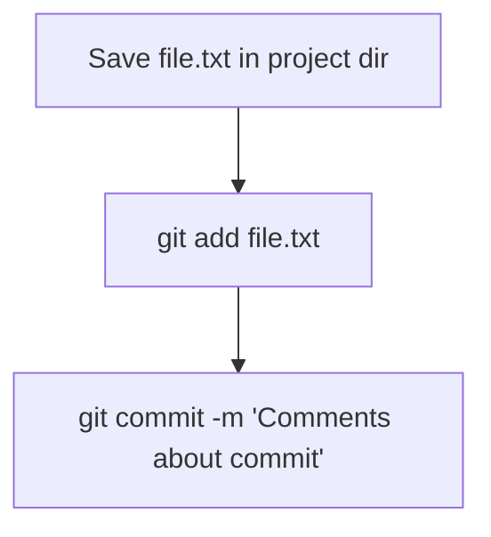
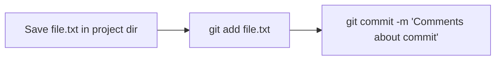

# Шпаргалка по GIT  и GITHUB
---

## GIT 

GIT - система контроля версий

## Командная строка

Большинство пользователей Git используют консоли с наборами команд, похожие на те, что применяют в macOS и Linux. 

Для этого нужно установить специальный консольный инструмент для Windows, который называется Git Bash.

Он установит не только Bash, но и сам Git

## Создаем локальный репозиторий

### Инициализируем репозиторий — **git init**

Чтобы Git начал отслеживать изменения в проекте, папку с файлами этого проекта нужно сделать Git-репозиторием. Для этого следует переместиться в неё и ввести команду git init
```
$ cd ~/dev/first-project # перешли в нужную папку
$ git init # создали репозиторий
```
В подпапке .git Git будет хранить всю служебную информацию.

**«Разгитить» папку, если что-то пошло не так, — rm -rf .git**
```
$ cd <папка с репозиторием> # перешли в папку

$ rm -rf .git # удалили подпапку .git
```
-rf:
* ключ -r (от англ. recursive — «рекурсивно») позволяет удалять папки вместе с их содержимым;
* ключ -f (от англ. force — «заставить») избавит вас от вопросов вроде «Вы точно хотите удалить этот файл? А этот? И этот тоже?».

###Проверить состояние репозитория — **git status**

После инициализации репозитория first-project запустите команду git status — она показывает текущее состояние репозитория.

### Подготовить файлы к сохранению — **git add**

Создайте файлы todo.txt и readme.txt в папке first-project 

Мы хотим отслеживать состояние обоих, поэтому можем использовать команду git add --all. 
```
$ touch todo.txt
$ touch readme.txt
# создали файлы todo.txt и readme.txt

$ git add --all # подготовили к сохранению все файлы в репозитории
$ git status # проверили статус  
```

Добавлять файлы можно и по одному.
```
$ git add todo.txt
$ git add readme.txt
$ git status 
```

Также можно добавить текущую папку целиком. Обратиться к текущей папке в Bash позволяет точка (.).

```
$ git add . # добавить всю текущую папку
$ git status 
```

### Делаем коммит — **git commit**

Коммит гарантирует, что изменения будут сохранены в истории и при необходимости к ним можно будет «откатиться». 

gерейдите в папку first-project и выполните коммит со следующим комментарием.

```
$ git commit -m 'Мой первый коммит!' 
```

Ключ -m присваивает коммиту сообщение.
Обычно в таком сообщении поясняется, в чём именно состояли изменения. Оно пишется после ключа -m в кавычках.


Отобразим процесс коммита сехмой mermaid:
* flowchart TD блок-схема программы
* graph LR - обычная графичесская схема

Вертикальная блок схема:



Горизонтальная блок схема:



### Просматриваем историю коммитов — **git log**

Чтобы увидеть все коммиты, введите команду git log.

Обратите внимание, что по умолчанию git log выводит коммиты в обратном хронологическом порядке — последние коммиты оказываются первыми сверху. В этом можно убедиться, если посмотреть на дату и время их создания.

## Создаем удаленный репозиторий на **GitHub**

GitHub — платформа для хранения IT-проектов и совместной работы над ними с использованием Git. По сути, это сайт, куда можно загрузить файлы своего проекта для обмена с другими людьми.

Git и GitHub — это два разных проекта, которые развиваются независимо друг от друга. 

Git:
- консольный инструмент для работы с локальными и удалёнными репозиториями;
- проект с открытым исходным кодом.

GitHub:
- платформа для размещения удалённых репозиториев;
- принадлежит компании Microsoft.

**Инструкция**

1. Зайдите в свой профиль по ссылке https://github.com/username, где username — имя, которое вы указали при регистрации.
1. Создайте репозиторий. Для этого перейдите на вкладку Repositories (англ. «репозитории»), а затем нажмите на зелёную кнопку New (англ. «новый») справа.
1. Открылось окно создания нового репозитория. Назовите его first-project. Название удалённого репозитория необязательно должно совпадать с именем папки проекта у вас на компьютере. Но чтобы не путаться, будем называть их одинаково.

Другие поля вам пока не понадобятся. Смело нажимайте на зелёную кнопку Create repository (англ. «создать репозиторий») внизу.

Осталось связать удалённый репозиторий с локальным, который уже есть на вашем компьютере.

Но прежде, чтобы упростить работу с GitHub и сделать её более безопасной, вы научитесь генерировать SSH-ключи (от англ. Secure Shell — «безопасная оболочка»).


